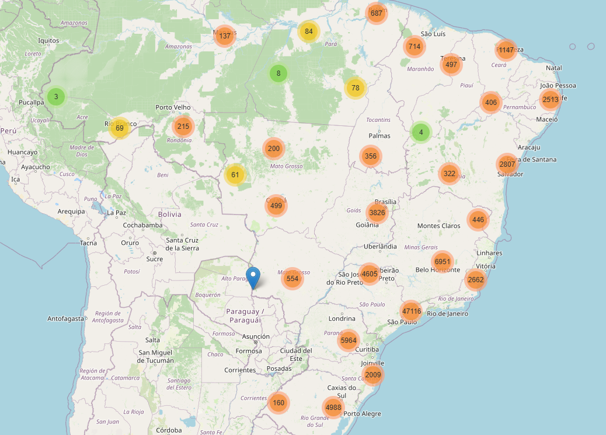
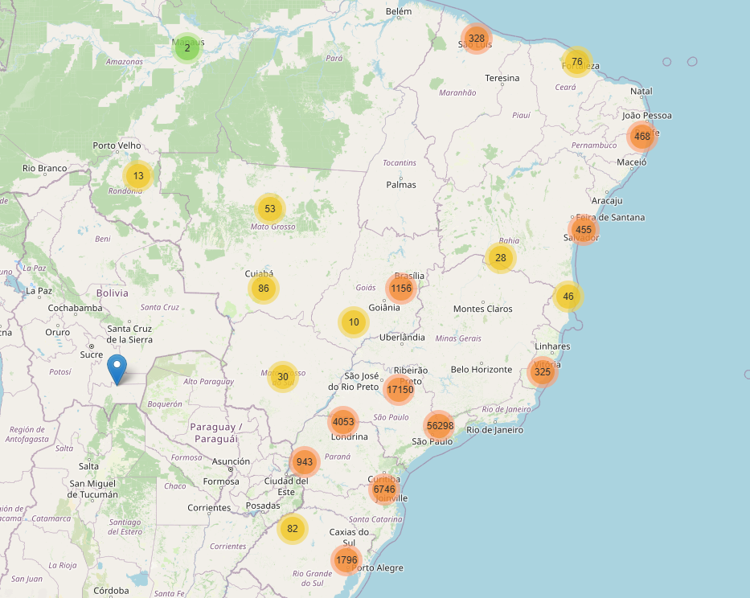
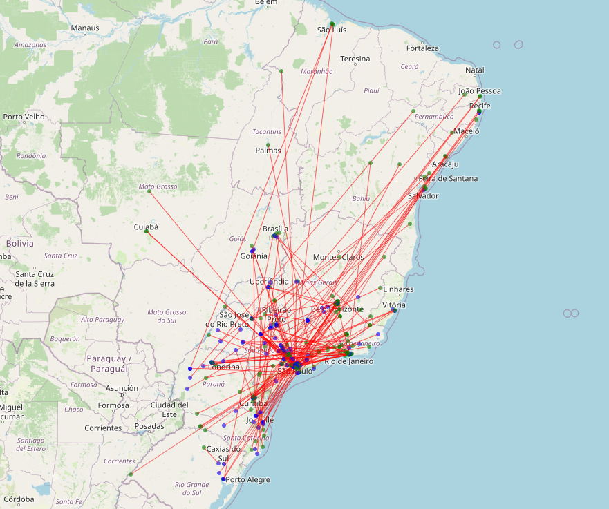

# 📦 Predicting e-commerce delivery times. Olist dataset (Brazil)

Originated as the **final project** of the *Postgraduate Diploma in Data Science, AI and their Applications in Economics and Business*, Universidad Nacional de Córdoba ([diplocienciadedatos.com.ar](https://diplocienciadedatos.com.ar)) · 2025. This repository evolves independently from that course submission.

**Author:** Alejandro Mezio

## 🎯 The problem

[Olist](https://www.kaggle.com/datasets/olistbr/brazilian-ecommerce) is the largest marketplace in Brazil. Its delivery date estimator is very imprecise: it misses by **more than 12 days** on average. A poor estimate hurts the buying experience and the sellers' reviews.

**Goal:** build a Machine Learning model that predicts the actual delivery days of an order more precisely than Olist's original estimator.

## 🏆 Headline result

**XGBoost predicts the actual delivery days with an MAE of 4.43 days in 5-fold cross-validation (4.38 on the held-out test set): a 22% error reduction over the strongest trivial baseline and 9% over linear regression.**

Test-set comparison:

| Model | MAE (days) | RMSE (days) |
|---|---|---|
| **XGBoost (selected model)** | **4.38** | **7.14** |
| Linear Regression (scientific baseline) | 4.82 | 7.16 |
| Constant prediction (train median, 9 days) | 5.60 | 8.63 |
| Olist's original estimator (business benchmark) | 12.63 | 14.53 |

An honest reading of that last row: Olist's estimator is a **promise date, not a prediction**. It overshoots actual deliveries by **+11.5 days on average**, and 93% of orders arrive on or before it, so most of its 12.6-day MAE is deliberate bias rather than inability to predict. Beating it confirms the model is useful to the business; the modelling contribution itself is measured against the constant and linear baselines above.

The most relevant features (SHAP importance grouped by original variable): whether the order stays **within the same state** (32%) and the **distance in km between buyer and seller** (31%) dominate, followed by the **buyer-seller route** (13%), the **freight value** (9%) and the **chargeable weight** (7%).

**The result survives a deployment-faithful temporal evaluation** (train on the past, test on the future; see below): forward MAE is 4.84 ± 1.16 days across expanding-window periods, and 3.82 on the most recent three-month window.

All baseline numbers are reproducible with [`scripts/baseline_check.py`](scripts/baseline_check.py), which replicates the notebook's exact split and pipeline (its linear-regression CV matches the notebook's stored 4.824247 ± 0.034458 to six decimals).

## 🔬 Methodology

### 1. Exploratory Analysis and Cleaning ([`Part1_Olist_Exploratory_Analysis.ipynb`](Part1_Olist_Exploratory_Analysis.ipynb))

- Individual EDA of the 9 tables of the dataset (~100k orders, ~1M geolocation records): handling of duplicates, missing values and outliers.
- Join of the tables into a single order-level dataset.
- **Feature engineering:** volumetric weight, seller-customer distance (geopy), temporal variables, state-to-state routes, product categories.
- Univariate, bivariate and geographic analysis.

| Customers | Sellers | Routes |
|---|---|---|
|  |  |  |

*The concentration of sellers in São Paulo vs. the dispersion of customers across the whole country explains why distance is the most predictive variable.*

### 2. Modelling ([`Part2_Olist_Machine_Learning.ipynb`](Part2_Olist_Machine_Learning.ipynb))

**9 regression models** were trained and compared using scikit-learn pipelines, cross-validation and hyperparameter search (Grid/Randomized Search). Validation results (5-fold CV on the training set, best configuration per model):

| Model | MAE (CV) ± fold std | RMSE (CV) |
|---|---|---|
| Constant baseline (fold-train median) | 5.635 ± 0.070 | 8.645 |
| Linear Regression (base) | 4.824 ± 0.034 | 7.148 |
| Lasso (L1) | 4.824 ± 0.035 | 7.149 |
| Ridge (L2) | 4.823 ± 0.035 | 7.149 |
| Ridge + polynomials (degree 2) | 4.781 ± 0.033 | 7.117 |
| Decision Tree | 4.756 ± 0.038 | 7.106 |
| Random Forest | 4.649 ± 0.035 | **6.986** |
| **XGBoost** | **4.430 ± 0.045** | 7.158 |
| SVM Regressor (LinearSVR) | 4.633 ± 0.041 | 7.344 |
| SGD Regressor | 4.633 ± 0.041 | 7.344 |

How to read the uncertainty: XGBoost's MAE lead over Random Forest (0.22 days) is roughly 5 times its fold-to-fold std (0.045 days), so the ranking is stable. The differences within the linear family (4.824 vs 4.823) sit far inside fold noise: those are ties. Random Forest wins RMSE, but **XGBoost** was selected by MAE, the metric declared before the comparison. The model was then interpreted through feature importance and per-feature performance analysis (SHAP).

### 3. Temporal evaluation ([`Part3_Temporal_Evaluation.ipynb`](Part3_Temporal_Evaluation.ipynb))

The Part 2 protocol splits randomly, letting the model "see the future" of the period it is tested on. Part 3 re-evaluates the selected model under a deployment-faithful protocol: train only on orders **purchased and delivered** before a cutoff (2018-05-26, the 80% quantile), test on everything after, plus an expanding-window `TimeSeriesSplit` CV.

| Model | Random test MAE | Temporal test MAE | Expanding-window MAE (5 folds) |
|---|---|---|---|
| Olist estimator (benchmark) | 12.63 | 13.49 | — |
| Constant (train median) | 5.60 | 4.34 | — |
| Linear Regression | 4.82 | 4.88 | 5.08 ± 0.90 |
| **XGBoost (best params)** | **4.38** | **3.82** | **4.84 ± 1.16** |

The two findings: **the headline is not inflated by the random split** (the final window is actually easier: deliveries in mid-2018 are faster and less dispersed, which is why even the constant median improves there), but **random-split CV hides the real uncertainty structure**: forward error varies by period from 3.7 to 6.7 days (fold std ≈ 1.1), roughly 30 times the ± 0.03 fold noise random CV reports. The honest deployment claim is forward MAE ≈ 4.8 ± 1.1 days across periods, not 4.43 ± 0.03.

### Evaluation notes

- **Leakage discipline:** `review_score` exists in the dataset but is deliberately excluded from the features: reviews are written after delivery, so including it would leak the outcome into the prediction.
- **Seller memorization, quantified** (Part 3, section 14): with validation sellers excluded from training (`GroupKFold` on `seller_id`), XGBoost's MAE degrades from 4.41 ± 0.04 to 4.54 ± 0.07 (a bounded 2.9%), while linear regression, lacking the capacity to memorize seller fingerprints, shows no gap (4.82 vs 4.83). The XGBoost-over-linear ranking survives; the 0.13-day gap is the upper bound on the seller-memorization component of the headline.

## 📁 Repository structure

| Folder/File | Description |
|---|---|
| `Part1_Olist_Exploratory_Analysis.ipynb` | EDA, cleaning, table joins and feature engineering. |
| `Part2_Olist_Machine_Learning.ipynb` | Pipelines, training, model comparison and selection. |
| `Part3_Temporal_Evaluation.ipynb` | Train-on-past / test-on-future evaluation vs the random split. |
| `data/processed/` | Datatype schemas of the cleaned datasets. The CSVs (final dataset: `orders_final.csv`) are not versioned: `Part1` regenerates them from the raw data. |
| `Brasil_*.png` | Maps of customers, sellers and routes. |
| `scripts/baseline_check.py` | Reproduces the split and computes the baseline/uncertainty numbers quoted above. |
| `requirements.txt` | Dependencies (Python 3.11). |

## ⚙️ Installation and reproduction

1. Clone the repository:

   ```bash
   git clone https://github.com/alemezio/Olist_Ecommerce_Brazil_project.git
   cd Olist_Ecommerce_Brazil_project
   ```

2. Install dependencies (Python 3.11):

   ```bash
   pip install -r requirements.txt
   ```

3. Run the notebooks in order:

   - `Part1_Olist_Exploratory_Analysis.ipynb`: Downloads the raw data via `kagglehub` and generates the clean dataset.
   - `Part2_Olist_Machine_Learning.ipynb`: Trains and evaluates the models from `data/processed/orders_final.csv`.
   - `Part3_Temporal_Evaluation.ipynb`: Runs the temporal and seller-grouped evaluations on the same dataset.

## 🔮 Future work

- **Incorporate reviews:** analyze the relation between ratings and delivery times to build a seller "score".
- **Narrow the temporal range:** train only with 2018 data, when the sales volume was higher and more stable.

## 📄 Data and licenses

The data comes from the [Brazilian E-Commerce Public Dataset by Olist](https://www.kaggle.com/datasets/olistbr/brazilian-ecommerce) (Kaggle), published by Olist under the **CC BY-NC-SA 4.0** license: ~100k real, anonymized orders (2016-2018). Derived datasets keep that license. The code in this repository is distributed under the [MIT](LICENSE) license.

## 📬 Contact

Questions or suggestions:

- 💼 [LinkedIn](https://www.linkedin.com/in/alejandro-mezio/)
- 📧 [alejandro.mezio@gmail.com](mailto:alejandro.mezio@gmail.com)
- 🐙 [GitHub](https://github.com/alemezio)
